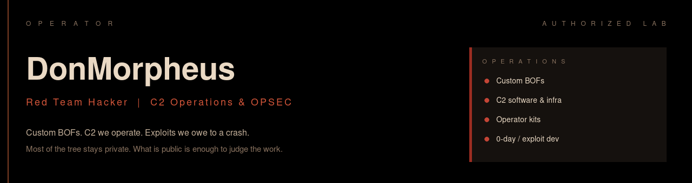

  

 

I build the kit we operate. Custom BOFs for jobs the stock payload cannot do. C2 software and the infrastructure under it. Operator kits that have to survive a real desktop. 0-day research that is supposed to end in an exploit — not a slide.

The public repos are the edge of that work. The rest stays in the lab.

---

## Operations

<table>
<tr>
<td width="50%" valign="top">

### Custom BOFs

In-process operator modules, written for the C2 we actually run. Credentials, inject, persist, HVNC, patches — compiled, loaded, used on a session. If CoffeeLdr, the object file, or the job model is broken, we fix the BOF. We do not screenshot someone else’s repo and call it a capability.

</td>
<td width="50%" valign="top">

### C2 software &amp; infrastructure

Teamserver, listeners, staging, implants, lab redirectors. Sleep, jitter, channel, what the callback still leaks. C2 is a detection problem as much as a framework: periodicity, process, destination, size versus the binary it pretends to be. We operate it. We break our own OPSEC on purpose and write down what still shows.

</td>
</tr>
<tr>
<td width="50%" valign="top">

### Operator kits

Loaders and persist that have to work on a workstation, not in a gist. Early Bird APC, COM TreatAs / ClickOnce, Linux eBPF persist, a HiddenDesktop HVNC port that actually talks back. The kit is for the operator at the console — launch, inject, rportfwd, keep the desktop.

</td>
<td width="50%" valign="top">

### 0-day research &amp; exploit development

Crash-to-exploit on software in authorized scope. Parsers, services, IPC, third-party Windows and Linux targets. C, taint, crash triage, then the exploit — not a PoC that dies on the next build. Findings stay private until there is a coordinated path. The method is public enough to be judged.

</td>
</tr>
</table>

---

## Public traces

The notes and code we can show without burning lab infra or a research target.

- **[fieldnotes](https://github.com/DonMorpheus/fieldnotes)** — lab manual. How the chain was run, what was left on disk, what blue still sees.
- **[loaders](https://github.com/DonMorpheus/loaders)** — staging and persist in C. Early Bird, COM (`T1546.015`), eBPF implant (`T1547.006`).
- **[havoc-hiddendesktop](https://github.com/DonMorpheus/havoc-hiddendesktop)** — working HVNC operator kit. Stock BOF dies on CoffeeLdr / inject / rportfwd. This tree does not.
- **[ctf-toolkit](https://github.com/DonMorpheus/ctf-toolkit)** — scripts from boxes we rooted. No flags, no VPN configs, no live credentials.

---

  Authorized lab &amp; security research only. Not a license to attack systems you do not own.

