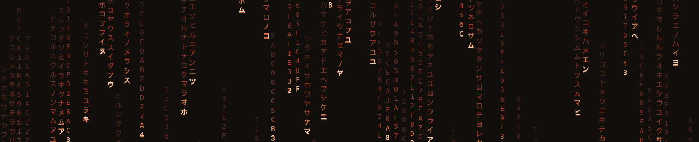
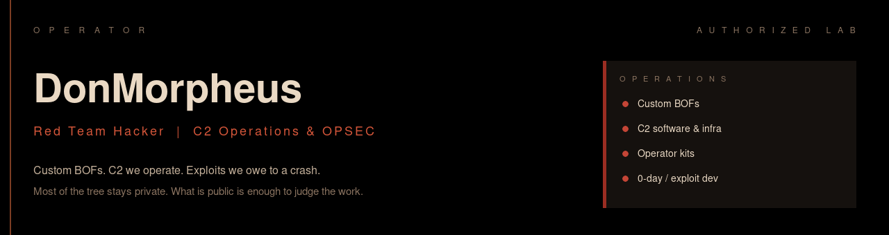
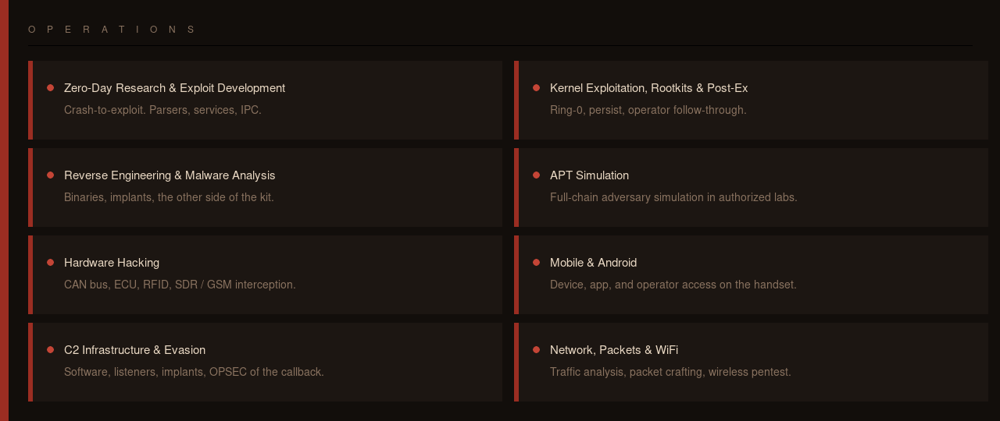
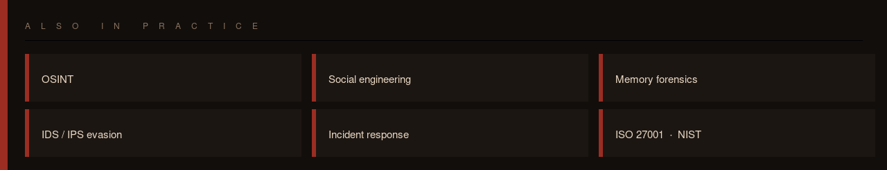
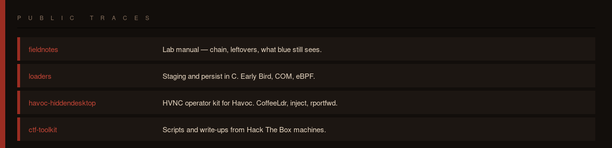

  
  

 

Red Team Hacker with a wide offensive and defensive range. I build C2, write BOFs, develop exploits, and run APT-style simulation in authorized labs. Hardware, mobile, RF and the network stack sit in the same practice.

Hands stay sharp on advanced Hack The Box machines. Technical write-ups live on GitHub.

Open to red team / pentest projects and collaboration with people in the field.

  

**Custom BOFs.** In-process operator modules for the C2 we run. Credentials, inject, persist, HVNC, patches — compiled, loaded, used on a live session.

**C2 software and infrastructure.** Teamserver, listeners, staging, implants, lab redirectors. Sleep, jitter, channel, and the telemetry the callback still leaves. We operate it.

**Operator kits.** Early Bird APC, COM TreatAs / ClickOnce, Linux eBPF persist, HiddenDesktop HVNC for Havoc. Launch, inject, rportfwd, keep the desktop.

**0-day research and exploit development.** Crash-to-exploit on parsers, services and IPC. C, taint, crash triage, then the exploit. Coordinated disclosure when a path exists.

  

  

  <a href="https://github.com/DonMorpheus/fieldnotes">fieldnotes</a>
  ·
  <a href="https://github.com/DonMorpheus/loaders">loaders</a>
  ·
  <a href="https://github.com/DonMorpheus/havoc-hiddendesktop">havoc-hiddendesktop</a>
  ·
  <a href="https://github.com/DonMorpheus/ctf-toolkit">ctf-toolkit</a>

  Authorized laboratory and security research. Scope: systems you own, or written permission.

